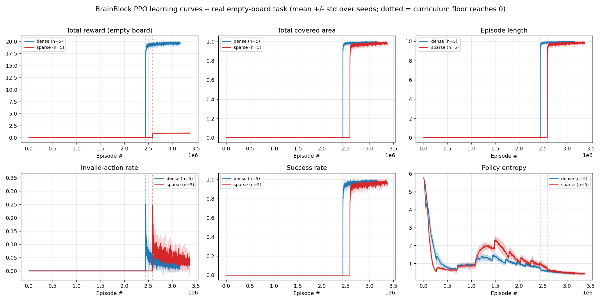
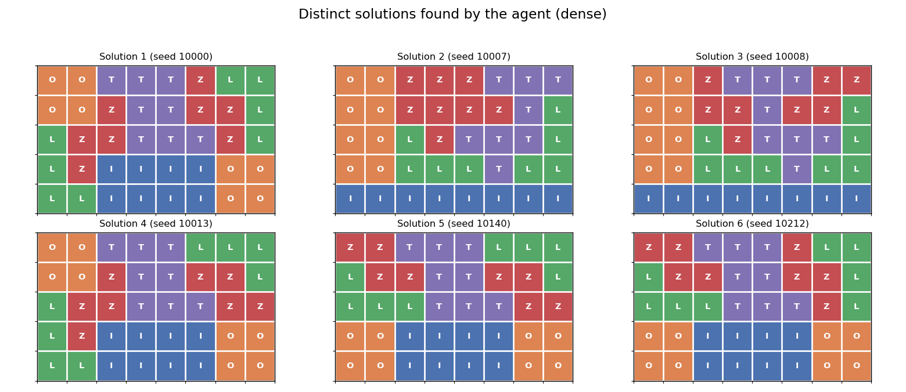
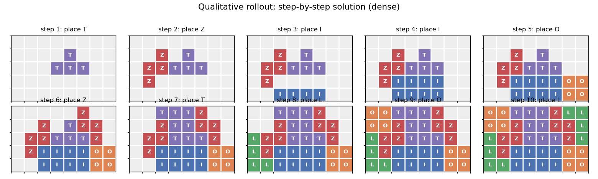

# BrainBlock Packing with Deep Reinforcement Learning

**CS 445 & 545 — Spring 2026 Project Report**

> Convert to PDF for submission, e.g.:
> `pandoc REPORT.md -o REPORT.pdf` (figures in `figures/` are referenced relatively).

---

## 1. Problem and MDP Formulation

We solve the BrainBlock packing puzzle: tile an **8×5** board (40 cells) with a
fixed inventory of **10 tetrominoes** (2 each of I, O, L, Z, T) delivered one at
a time from a **shuffled queue**. We formulate it as a finite-horizon MDP.

**State / observation.** The observation has the three required components:

1. **Board** — a single-channel `8×5` binary grid (1 = filled, 0 = empty).
2. **Current piece** — a one-hot vector over the 5 tetromino types (the queue head).
3. **Remaining pieces** — a length-5 vector of remaining inventory counts.

*Design justification.* A single occupancy channel is the minimal sufficient
board encoding — the geometry of what *can* fit is fully determined by which
cells are free, so additional channels are redundant. The current piece is
non-spatial (a categorical label), so it is provided as a vector rather than
painted onto the board. The inventory counts capture "what is still to come"
without revealing the exact future order (which is genuinely stochastic), so the
agent learns a policy robust to queue order rather than memorizing one sequence.

**Action space.** Discrete, size `8 × 8 × 5 = 320`, exactly the Cartesian product
required by the assignment:

```
A = {orientation 0..7} × {x 0..7} × {y 0..4}
```

flattened as `action = orientation·(W·H) + x·H + y`. The first component selects
one of 8 oriented variants (4 rotations × 2 mirrors; symmetric pieces map
redundant indices to equivalent transforms), and `(x, y)` is the anchor.

**Piece geometry is computed, not learned.** The map `(type, orientation) → 4
occupied cells` is a deterministic function over only 40 input combinations. We
implement it as an analytic lookup table (`brainblock/pieces.py`); every
tetromino fits in a 4×4 bounding box (required only by the I piece). This table
*is* the environment's transition geometry — it drives legality checks, board
updates, and rendering. Learning it with a network would only memorize a
constant (imperfectly), so all model capacity is reserved for the packing policy.

**Transition & termination.** Given the current queue-head piece and a chosen
`(orientation, x, y)`, the placement is **legal** iff all 4 oriented cells are
in-bounds and non-overlapping. A legal placement writes the piece, advances the
queue, and continues. The episode terminates on **completion** (all 10 placed →
board full) or on **any invalid placement** (hard termination).

**No action masking — a deliberate design choice.** We do *not* mask illegal
actions. The agent outputs logits over all 320 actions and must *learn* legality
from experience. This makes the **invalid-action rate a real learning signal**
(with masking it would be ~0 by construction and the metric vacuous). The
trade-off — harder exploration — is analyzed in §5.

---

## 2. Reward Functions (≥2, compared)

We compare two reward functions sharing the same termination dynamics:

| | per legal placement | completion bonus | invalid placement |
|---|---|---|---|
| **R_dense** (shaped) | **+1** | **+10** | 0 (terminate) |
| **R_sparse** | 0 | **+1** | 0 (terminate) |

**Motivation.** `R_dense` provides a dense progress signal (every accepted piece
is rewarded) plus a large terminal bonus that makes a full solve worth far more
(20) than any partial episode (≤ ~9). `R_sparse` is the unshaped baseline: the
agent is rewarded *only* for a complete tiling, posing a hard temporal
credit-assignment problem (it must chain 10 correct placements before any signal).

**Why invalid = 0 (a reward-design finding).** Because an invalid placement
already hard-terminates the episode, it carries an *implicit* cost: the agent
forfeits all remaining reward. We initially added an explicit −1 penalty and
observed a **risk-averse failure mode** (§5): placing the next piece becomes a
negative-expected-value gamble whenever the agent's per-step success probability
is below ~0.5, so the policy converged to safely placing ~5 pieces and *never*
completing — never experiencing the completion bonus that would teach it to
finish. Removing the explicit penalty (letting termination be the only cost)
makes each additional legal placement pure upside and restores deep exploration.

---

## 3. Algorithm and Architecture

**Algorithm: PPO (Proximal Policy Optimization)**, actor-critic, implemented from
scratch (`brainblock/ppo.py`): synchronous vectorized rollouts, Generalized
Advantage Estimation (GAE), a clipped surrogate policy loss, a clipped value
loss, an entropy bonus, advantage normalization, and gradient clipping.

**Network (`brainblock/model.py`).** A CNN actor-critic:

```
board (B,1,5,8) → Conv3×3(1→32) → ReLU → Conv3×3(32→64) → ReLU → flatten
                                                                     │
piece one-hot (5) ─────────────────────────────────────┐            │
inventory counts (5) ───────────────────────────────────┴── concat ─┤
                                                                     │
                                       2× Linear(→256)+ReLU (shared trunk)
                                          ├── actor head → 320 logits
                                          └── critic head → scalar value
```

*Justification.* Convolutions give a spatial inductive bias appropriate to a
spatial packing problem; the non-spatial piece/inventory vectors are concatenated
after the conv flatten rather than forced through convolution. The actor's final
layer uses a small (0.01) orthogonal gain so the initial policy is near-uniform
over 320 actions (verified: initial log-prob ≈ ln(1/320) ≈ −5.77), which
stabilizes early PPO updates.

**Diversity mechanism.** The entropy bonus keeps the policy stochastic during
training (so it explores many solutions); the shuffled queue makes different
seeds yield different piece orders; at **evaluation we sample** from the policy
(not argmax) across seeds, which surfaces distinct solutions (§5).

### Hyperparameters

| Hyperparameter | Value |
|---|---|
| total timesteps | `<FILL>` per run |
| parallel envs | `<FILL>` |
| rollout steps | 128 |
| discount γ | 0.99 |
| GAE λ | 0.95 |
| PPO clip ε | 0.2 |
| epochs / minibatches | 4 / 4 |
| entropy coef | `<FILL>` |
| value coef | 0.5 |
| learning rate | 2.5e-4 (`<anneal?>`) |
| max grad norm | 0.5 |
| optimizer | Adam (eps 1e-5) |

---

## 4. Experimental Setup and Evaluation

Following the protocol, each major experiment (one per reward function) is run
over **5 random seeds**. Training metrics are logged per update; evaluation runs
`<N>` episodes per seed on held-out queue seeds. We report, with mean ± std over
seeds:

- **success rate** (fraction of episodes fully solved),
- **episodic return** (mean and std),
- **mean episode length**,
- **invalid-action rate**,
- learning curves (§5), and a qualitative step-trace rollout.

Commands to reproduce are in `README.md`.

---

## 5. Results

*(Filled from `results/eval_*.json` and `figures/` after the experiment run.)*

### 5.1 Learning curves



*Figure: mean ± std over 5 seeds for total reward, total covered area, episode
length, and invalid-action rate vs. episode #, comparing R_dense and R_sparse.*

`<DISCUSS: dense learns to complete; sparse struggles / slower; coverage rises to
1.0 for dense; invalid-rate falls as success rate rises; episode length rises
toward 10.>`

### 5.2 Aggregate metrics (5 seeds)

| Metric | R_dense | R_sparse |
|---|---|---|
| success rate | `<FILL>` | `<FILL>` |
| return (mean ± std) | `<FILL>` | `<FILL>` |
| mean episode length | `<FILL>` | `<FILL>` |
| covered fraction | `<FILL>` | `<FILL>` |
| invalid-action rate | `<FILL>` | `<FILL>` |

### 5.3 Sample solutions (≥5 distinct)



*Figure: distinct full tilings discovered by the agent (different queue seeds).*

### 5.4 Qualitative rollout



*Figure: one rollout placing pieces one at a time until the board is tiled.*

### 5.5 Failure-case discussion

- **Risk-averse local optimum under an explicit invalid penalty** (§2): the agent
  stops placing after ~5 pieces and never completes. Fixed by `invalid = 0`.
- **Dead-ends:** greedy placement can fill the board into a configuration where
  the current piece has no legal placement; without masking the agent then
  necessarily commits an invalid move and terminates. `<Quantify how often.>`
- **Sparse reward:** `<DISCUSS whether/how well R_sparse learned.>`

---

## 6. Conclusions and Future Work

`<Summarize: PPO with a dense progress+completion reward and no action masking
solves BrainBlock and finds many distinct solutions; the invalid-penalty finding;
sparse-vs-dense comparison.>`

**Future improvements.** Invalid-action masking (faster, at the cost of a
trivial invalid-rate metric); a recurrent or attention encoder over the remaining
queue; potential-based reward shaping; curriculum over board size; and exploring
off-policy methods (e.g., masked DQN) for sample efficiency.

---

## 7. Tools, Methodology Disclosure, and Use of Generative AI

**Reverse-curriculum and the backtracking solver (disclosure).** Training uses a
reverse curriculum in which the board is pre-filled with the first *k* pieces of
a known valid tiling (see §3, §5). Those tilings are produced by a deterministic
backtracking exact-cover **solver** (`brainblock/solver.py`). We disclose this
explicitly and emphasize its scope:

- The solver is a **training-time aid only**. It supplies *starting board
  configurations* (and verifies that agent outputs are valid exact covers). It
  **never tells the agent which action to take** — the policy is learned entirely
  by PPO from reward.
- **All reported and demonstrated solutions are produced by the learned policy
  from an empty board, with no solver assistance.** Evaluation always uses
  prefill = 0. The live demo solves from an empty board.
- Nothing in the assignment forbids curricula or auxiliary verification tools;
  the curriculum is analogous to reward shaping. We report a no-curriculum
  baseline (§5) for transparency, which plateaus without completing.

**Use of Generative AI.** `<EDIT THIS TO MATCH YOUR ACTUAL USAGE.>` Generative AI
(Anthropic's Claude) was used as a coding and design assistant for this project:
to help design the MDP/state encoding, implement the Gymnasium environment, the
CNN actor-critic network, and the PPO training/evaluation pipeline, to diagnose
training failure modes (the risk-averse local optimum and the exploration wall),
and to draft this report. All design decisions, experiments, and final results
were directed, reviewed, and validated by the authors. No external code was
copied; the implementation is original. `<Add any course-specific required
statement here.>`
