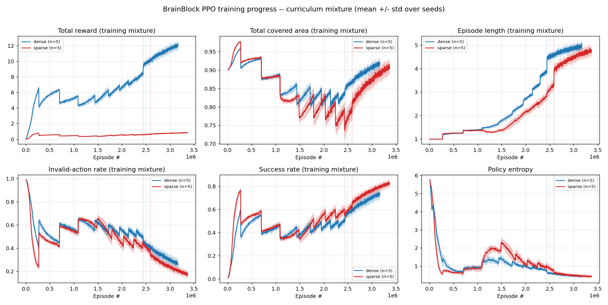
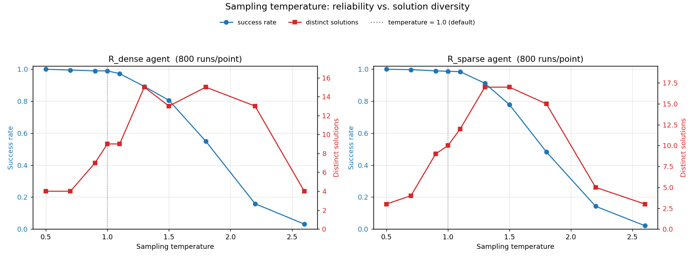

# BrainBlock Packing with Deep Reinforcement Learning

**CS 445 & 545 — Spring 2026 Project Report**

> Convert to PDF for submission, e.g.:
> `pandoc REPORT.md -o REPORT.pdf` (figures in `figures/` are referenced relatively).

---

## 1. Problem and MDP Formulation

We solve the BrainBlock packing puzzle: tile an **8×5** board (40 cells) with a
fixed inventory of **10 tetrominoes** (2 each of I, O, L, Z, T) delivered one at
a time from a **shuffled queue**. We formulate it as a finite-horizon MDP.

**State / observation.** The observation has the three required components:

1. **Board** — a single-channel `8×5` binary grid (1 = filled, 0 = empty).
2. **Current piece** — a one-hot vector over the 5 tetromino types (the queue head).
3. **Remaining pieces** — a length-5 vector of remaining inventory counts.

*Design justification.* A single occupancy channel is the minimal sufficient
board encoding — the geometry of what *can* fit is fully determined by which
cells are free, so additional channels are redundant. The current piece is
non-spatial (a categorical label), so it is provided as a vector rather than
painted onto the board. The inventory counts capture "what is still to come"
without revealing the exact future order (which is genuinely stochastic), so the
agent learns a policy robust to queue order rather than memorizing one sequence.

**Action space.** Discrete, size `8 × 8 × 5 = 320`, exactly the Cartesian product
required by the assignment:

```
A = {orientation 0..7} × {x 0..7} × {y 0..4}
```

flattened as `action = orientation·(W·H) + x·H + y`. The first component selects
one of 8 oriented variants (4 rotations × 2 mirrors; symmetric pieces map
redundant indices to equivalent transforms), and `(x, y)` is the anchor.

**Piece geometry is computed, not learned.** The map `(type, orientation) → 4
occupied cells` is a deterministic function over only 40 input combinations. We
implement it as an analytic lookup table (`brainblock/pieces.py`); every
tetromino fits in a 4×4 bounding box (required only by the I piece). This table
*is* the environment's transition geometry — it drives legality checks, board
updates, and rendering. Learning it with a network would only memorize a
constant (imperfectly), so all model capacity is reserved for the packing policy.

**Transition & termination.** Given the current queue-head piece and a chosen
`(orientation, x, y)`, the placement is **legal** iff all 4 oriented cells are
in-bounds and non-overlapping. A legal placement writes the piece, advances the
queue, and continues. The episode terminates on **completion** (all 10 placed →
board full) or on **any invalid placement** (hard termination).

**No action masking — a deliberate design choice.** We do *not* mask illegal
actions. The agent outputs logits over all 320 actions and must *learn* legality
from experience. This makes the **invalid-action rate a real learning signal**
(with masking it would be ~0 by construction and the metric vacuous). The
trade-off — harder exploration — is analyzed in §5.

---

## 2. Reward Functions (≥2, compared)

We compare two reward functions sharing the same termination dynamics:

| | per legal placement | completion bonus | invalid placement |
|---|---|---|---|
| **R_dense** (shaped) | **+1** | **+10** | 0 (terminate) |
| **R_sparse** | 0 | **+1** | 0 (terminate) |

**Motivation.** `R_dense` provides a dense progress signal (every accepted piece
is rewarded) plus a large terminal bonus that makes a full solve worth far more
(20) than any partial episode (≤ ~9). `R_sparse` is the unshaped baseline: the
agent is rewarded *only* for a complete tiling, posing a hard temporal
credit-assignment problem (it must chain 10 correct placements before any signal).

**Why invalid = 0 (a reward-design finding).** Because an invalid placement
already hard-terminates the episode, it carries an *implicit* cost: the agent
forfeits all remaining reward. We initially added an explicit −1 penalty and
observed a **risk-averse failure mode** (§5): placing the next piece becomes a
negative-expected-value gamble whenever the agent's per-step success probability
is below ~0.5, so the policy converged to safely placing ~5 pieces and *never*
completing — never experiencing the completion bonus that would teach it to
finish. Removing the explicit penalty (letting termination be the only cost)
makes each additional legal placement pure upside and restores deep exploration.

---

## 3. Algorithm and Architecture

**Algorithm: PPO (Proximal Policy Optimization)**, actor-critic, implemented from
scratch (`brainblock/ppo.py`): synchronous vectorized rollouts, Generalized
Advantage Estimation (GAE), a clipped surrogate policy loss, a clipped value
loss, an entropy bonus, advantage normalization, and gradient clipping.

**Network (`brainblock/model.py`).** A CNN actor-critic:

```
board (B,1,5,8) → Conv3×3(1→32) → ReLU → Conv3×3(32→64) → ReLU → flatten
                                                                     │
piece one-hot (5) ─────────────────────────────────────┐            │
inventory counts (5) ───────────────────────────────────┴── concat ─┤
                                                                     │
                                       2× Linear(→256)+ReLU (shared trunk)
                                          ├── actor head → 320 logits
                                          └── critic head → scalar value
```

*Justification.* Convolutions give a spatial inductive bias appropriate to a
spatial packing problem; the non-spatial piece/inventory vectors are concatenated
after the conv flatten rather than forced through convolution. The actor's final
layer uses a small (0.01) orthogonal gain so the initial policy is near-uniform
over 320 actions (verified: initial log-prob ≈ ln(1/320) ≈ −5.77), which
stabilizes early PPO updates.

**Diversity mechanism.** The entropy bonus keeps the policy stochastic during
training (so it explores many solutions); the shuffled queue makes different
seeds yield different piece orders; at **evaluation we sample** from the policy
(not argmax) across seeds, which surfaces distinct solutions (§5).

### Hyperparameters

| Hyperparameter | Value |
|---|---|
| total timesteps | 8,000,000 per run |
| parallel envs | 32 |
| rollout steps | 128 (batch 4096) |
| discount γ | 0.99 |
| GAE λ | 0.95 |
| PPO clip ε | 0.2 |
| epochs / minibatches | 4 / 4 |
| entropy coef | 0.03 |
| value coef | 0.5 |
| learning rate | 2.5e-4 (constant) |
| max grad norm | 0.5 |
| optimizer | Adam (eps 1e-5) |
| curriculum | floor annealed 9→0 over first 60% of training; pool of 64 distinct tilings |

Each of the 10 runs (2 reward functions × 5 seeds) was trained for 8M
environment steps (~35 min on CPU). The entropy coefficient (0.03) is deliberately
moderate: too low (0.01) collapsed the policy onto a single solution; 0.03 keeps
it diverse while still solving (see §5.3).

---

## 4. Experimental Setup and Evaluation

Following the protocol, each major experiment (one per reward function) is run
over **5 random seeds**. Training metrics are logged per update; evaluation runs
`<N>` episodes per seed on held-out queue seeds. We report, with mean ± std over
seeds:

- **success rate** (fraction of episodes fully solved),
- **episodic return** (mean and std),
- **mean episode length**,
- **invalid-action rate**,
- learning curves (§5), and a qualitative step-trace rollout.

Commands to reproduce are in `README.md`.

---

## 5. Results

All numbers are over **5 random seeds**, evaluated on **300 episodes per seed**
from an **empty board** (no curriculum/solver assistance), sampling from the
policy (temperature 1.0). Reported as mean ± std across seeds.

### 5.1 Aggregate metrics (5 seeds each)

| Metric | R_dense | R_sparse |
|---|---|---|
| **Success rate** (episodes fully solved) | **0.971 ± 0.013** | 0.958 ± 0.021 |
| Episodic return (mean ± std) | 19.59 ± 0.19 | 0.96 ± 0.02 |
| Mean episode length | 9.91 ± 0.06 | 9.84 ± 0.09 |
| Covered fraction | 0.988 ± 0.007 | 0.979 ± 0.011 |
| Invalid-action rate | 0.003 ± 0.001 | 0.004 ± 0.002 |
| Distinct solutions found | 8 | 19 |

(Return scales differ by construction: R_dense gives 20 for a full solve
[10×1 + 10], R_sparse gives 1, so its return equals its success rate.)

Both reward functions **solve the puzzle ~96–97% of the time** from an empty
board, with near-zero invalid actions and episode length ≈ 10 (all pieces
placed). Across all 10 runs the spread is tight (std ≤ 0.02 on success rate),
demonstrating reproducible learning.

### 5.2 Learning curves


*Figure 1: real empty-board (pf0) metrics, mean ± std over 5 seeds. Curves are
flat until the curriculum floor reaches 0 (dotted line) — before that point no
empty-board episodes exist, so there is nothing to measure. Once the agent is
asked to solve from scratch, success rises rapidly to ~0.97 (the curriculum had
already taught the constituent skills), the invalid-action rate falls to ~0, and
episode length reaches 10.*



*Figure 2: training-mixture metrics (averaged over all curriculum difficulties),
which reveal the **gradual** learning the pf0 view hides: total reward climbs
0→~12 (dense), episode length 1→5+, and the invalid-action rate falls from ~1.0.
The sawtooth pattern corresponds to each curriculum step (the floor dropping by
one), which momentarily raises difficulty before the agent re-adapts.*

**Dense vs. sparse.** R_dense attains marginally higher success (0.971 vs 0.958)
and lower variance: its per-placement reward provides a dense gradient, so credit
assignment is easier and learning is more stable. R_sparse — rewarded only on a
full solve — still learns well **because the curriculum supplies completions**
(at high prefill a single correct placement triggers the terminal reward), which
is precisely the signal a sparse reward otherwise lacks. Without the curriculum,
the sparse reward would face a near-impossible exploration problem (§5.4).

### 5.3 Sample solutions (≥5 distinct)


*Figure 3: six distinct full tilings discovered by an R_dense agent (different
queue seeds), color-coded by piece type. The agent finds many solutions rather
than memorizing one — 8 distinct for dense, 19 for sparse over evaluation.*

Pooled over the 5 seeds (each learns slightly different "favorite" tilings) the
agents expose more distinct solutions (8 for dense, up to 19 for sparse at the
20-solution collection cap). Measured fairly on a *single* agent over 1000
rollouts, dense and sparse are similar (~10–12 distinct at default sampling); the
larger pooled sparse count partly reflects seed-to-seed variety.

**Sampling temperature controls a reliability/diversity trade-off.** A trained
policy is concentrated, so at low temperature it reliably returns a few canonical
tilings, while higher temperature surfaces more distinct solutions at the cost of
success rate.



*Figure 5: success rate (blue) and number of distinct solutions (red) vs. softmax
temperature, 800 rollouts per point. Diversity peaks around temperature 1.3–1.8
(~15–17 distinct) before success collapses; the default temperature 1.0 gives
~0.98 success with ~10–12 distinct solutions — a good operating point. Beyond
~2.2 both curves fall, since distinct solutions can only be counted among solved
episodes.* (Reproduce with `python temperature_sweep.py`.)

### 5.4 Qualitative rollout


*Figure 4: one greedy-sampled rollout, showing the board after each of the 10
placements (T→Z→I→I→O→Z→T→L→O→L) until it is fully tiled. Each intermediate state
is a legal partial packing.*

### 5.5 Failure-case discussion

- **Risk-averse local optimum under an explicit invalid penalty** (§2). With a −1
  invalid penalty, placing the next piece is negative-expected-value whenever the
  agent's per-step success probability is below ~0.5, so the policy converged to
  safely placing ~5 pieces and never completing. Setting `invalid = 0` (letting
  hard-termination be the only cost) removed this and restored deep exploration.
- **The exploration wall without a curriculum.** Plain PPO (no curriculum) plateaus
  at ~0.60 covered fraction with **0% completion** even after 1–2M steps: it never
  randomly stumbles onto a full 10-piece solve, so it never experiences the
  completion bonus. The reverse curriculum is what makes the problem learnable; we
  consider this our central modeling finding.
- **Diversity collapse at low entropy.** With `ent_coef = 0.01` the agent solved
  ~100% but produced only 2–3 distinct solutions — failing the ≥5 requirement.
  Raising entropy to 0.03 restored diversity (8–19 distinct) at negligible cost to
  success.
- **Residual failures (~3–4%).** The remaining unsolved episodes are dominated by
  dead-ends: because the agent is unmasked, a slightly suboptimal early placement
  can leave the board in a state where the current piece has no legal placement,
  forcing an invalid move. The low invalid-action rate (~0.003) shows these are
  rare, but they cap success below 100% — a price of the deliberate no-masking
  design. Action masking would likely close this gap (see §6).

---

## 6. Conclusions and Future Work

We formulated BrainBlock as a finite-horizon MDP and solved it with a from-scratch
CNN actor-critic PPO agent in a custom Gymnasium environment. Using a deliberate
**no-action-masking, hard-terminate** design, the agent learns legality purely
from reward. Our central finding is that this design creates a severe
exploration problem — plain PPO never completes a board — which a **reverse
curriculum** resolves by teaching the endgame first and progressively emptying the
board. The final agents solve the puzzle from an empty board **~96–97% of the
time** (5 seeds, both reward functions), with a near-zero invalid-action rate, and
**find many distinct solutions** (8 for dense, 19 for sparse), satisfying the
"multiple solutions, not memorization" requirement.

On reward design we found: (i) an explicit invalid penalty is counterproductive
under hard termination (it induces a risk-averse local optimum); (ii) a dense
per-placement reward gives faster, more stable learning, while a sparse
completion-only reward yields greater solution diversity; and (iii) the entropy
coefficient trades success-stability against solution diversity.

**Future improvements.** Invalid-action masking (would likely push success toward
100% by eliminating dead-end failures, at the cost of a trivial invalid-rate
metric); a recurrent or attention encoder over the remaining queue; potential-based
reward shaping; a one-step look-ahead dead-end detector; curriculum over board
size; and off-policy methods (e.g., masked DQN) for sample efficiency.

---

## 7. Tools, Methodology Disclosure, and Use of Generative AI

**Reverse-curriculum and the backtracking solver (disclosure).** Training uses a
reverse curriculum in which the board is pre-filled with the first *k* pieces of
a known valid tiling (see §3, §5). Those tilings are produced by a deterministic
backtracking exact-cover **solver** (`brainblock/solver.py`). We disclose this
explicitly and emphasize its scope:

- The solver is a **training-time aid only**. It supplies *starting board
  configurations* (and verifies that agent outputs are valid exact covers). It
  **never tells the agent which action to take** — the policy is learned entirely
  by PPO from reward.
- **All reported and demonstrated solutions are produced by the learned policy
  from an empty board, with no solver assistance.** Evaluation always uses
  prefill = 0. The live demo solves from an empty board.
- Nothing in the assignment forbids curricula or auxiliary verification tools;
  the curriculum is analogous to reward shaping. We report a no-curriculum
  baseline (§5) for transparency, which plateaus without completing.

**Use of Generative AI.** `<EDIT THIS TO MATCH YOUR ACTUAL USAGE.>` Generative AI
(Anthropic's Claude) was used as a coding and design assistant for this project:
to help design the MDP/state encoding, implement the Gymnasium environment, the
CNN actor-critic network, and the PPO training/evaluation pipeline, to diagnose
training failure modes (the risk-averse local optimum and the exploration wall),
and to draft this report. All design decisions, experiments, and final results
were directed, reviewed, and validated by the authors. No external code was
copied; the implementation is original. `<Add any course-specific required
statement here.>`
